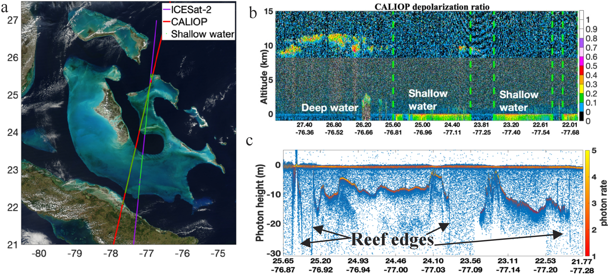

# ICESat-2 Bathymetry Overview

Interested in using ICESat-2 bathymetry data or exploring current research? This repository contains information about current and past research collected by members of the ICESat-2 bathymetry working group. 

  

## What can ICESat-2 do?
The [ICESat-2](https://icesat-2.gsfc.nasa.gov) mission is a satellite laser altimeter launched in 2018. Its photon counting lidar makes precise elevation measurements globally, including at high-latitudes. In addition to significant contributions to glaciology and forest mapping, ICESat-2 has proven capable of measuring the depth of the seafloor with sub-meter accuracy, and as deep as 40m in good conditions.

## What's the best way to access ICESat-2 data?
The working group is currently in the process of creating a bathymetric data product. Until then, users should download the geolocated photon data product ATL03 which contains all photon data. We recommend downloading ICESat-2 geolocated photon data either using web based tools like [NSIDC](https://nsidc.org/data/atl03/versions/5) and [OpenAltimetry](https://openaltimetry.org/data/icesat2/), or programmatically with tools like [SlideRule](http://icesat2sliderule.org) and [IcePyx](https://icepyx.readthedocs.io/en/latest/index.html).

For bathymetry focused data downloading tutorials, check out one of the demo notebooks [here](https://github.com/jonm3D/OpenOceans/blob/pkg/is2data/demos/Demo_SlideRule_Interactive_Query.ipynb) or [here](https://github.com/nmt28/C-SHELPh/tree/main/4.Tutorial).

The Science Team also maintains a list of general ICESat-2 tools and services available [here](https://nsidc.org/data/user-resources/help-center/icesat-2-tools-and-services).

## How do I correct depth data for refraction?

Refraction-corrected depths are not currently calculated for existing data, although this will likely be included on a future bathymetric product. The approach outlined in [Parrish, Magruder et al. 2019](https://www.mdpi.com/494326) has been frequently used and validated in research, although [new approaches](https://opg.optica.org/oe/fulltext.cfm?uri=oe-29-2-2411&id=446584) have been explored in the literature as well.

_Code implementations of Parrish 2019 are available in [Python](https://github.com/ICESat2-Bathymetry/Information/blob/main/code/photon_refraction.py) and [MATLAB](https://github.com/ICESat2-Bathymetry/Information/blob/main/code/refraction_correction_atlas.m)._

  

The angle of refraction, $\phi$, in the above figure is calculated from Snell's law and requires having a value for $n_2$, which can be computed as described in the [discussion of the refractive index of seawater and freshwater](http://research.engr.oregonstate.edu/parrish/index-refraction-seawater-and-freshwater-function-wavelength-and-temperature#overlay-context=research).

A water surface model (WSM) is also needed, and obtaining a WSM can be one of the more challenging aspects of refraction correction. 

## How do I extract the water surface and seafloor returns?
Photon data can be labeled by hand using the [OpenOceans Manual Classification Tool](https://github.com/jonm3D/OpenOceans) or [PhotonLabeler](https://github.com/Oht0nger/PhoLabeler) tools.

Automated methods of labeling large amounts of data are an open area of research. Which method is best may depend on your use case and desired accuracy.

__Automated Seafloor Extraction Codes__

1. C-SHELPh

  - Automated retrieval of bathy photons and ML regression modeling for satellite derived bathymetry. [Link to code](https://github.com/nmt28/C-SHELPh). [Link to Publication](https://doi.org/10.1029/2020GL092170).
  
2. More coming soon.

## ICESat-2 Bathymetry Member Research

[Nearshore bathymetry and seafloor property studies from Space lidars: CALIPSO and ICESat-2](https://opg.optica.org/oe/abstract.cfm?URI=oe-30-20-36509), Xiaomei Lu, Yongxiang Hu, Ali Omar, Yuekui Yang, Mark Vaughan, Sharon Rodier, Anne Garnier, Robert Ryan, Brian Getzewich, and Charles Trepte. (2022)

  

[A purely spaceborne open source approach for regional bathymetry mapping](https://ieeexplore.ieee.org/abstract/document/9834969) Nathan Thomas; Brian Lee; Oliver Coutts; Pete Bunting; David Lagomasino; Lola Fatoyinbo (2022)

  

[Diffuse Attenuation Coefficient (Kd) from ICESat-2 ATLAS Spaceborne Lidar Using Random-Forest Regression](https://www.ingentaconnect.com/content/asprs/pers/2021/00000087/00000011/art00011)  Corcoran, Forrest; Parrish, Christopher. (2021) [Link to code](https://github.com/fpcorcoran/ATLAS_Kd532).

  

### Recent Datasets by Members
[Bahamas Median DEM](https://ieee-dataport.org/documents/purely-spaceborne-open-source-approach-regional-bathymetry-mapping-bahamas-median-dem), from A PURELY SPACEBORNE OPEN SOURCE APPROACH FOR REGIONAL BATHYMETRY MAPPING (2022).
- A median composite DEM derived from a fusion of ICESat-2 and Landsat-8 data, created with a Extra Trees Regressor. Units are in m depth.

### Other Useful Data and Tools
- [NOAA Digital Coast](https://coast.noaa.gov/dataviewer/#/) - Repository for NOAA survey data. In particular, elevation data and topobathymetric lidar surveys available here have been useful for validation of ICESat-2 depth data.
- [NOAA Bathymetric Data Viewer](https://www.ncei.noaa.gov/maps/bathymetry/) - Great repository for ship-based sounding data.
- [General Bathymetric Chart of the Oceans (GEBCO)](https://download.gebco.net) - Global ocean bathymetric data available to download as a gridded product.
 -[EMODnet Bathymetry](https://www.emodnet-bathymetry.eu/) - European Marine Observation and Data Network (EMODnet) bathymetry portal provides a service for viewing and downloading a harmonised Digital Terrain Model (DTM) for the European sea regions.
 - [Tides and water levels](https://tidesandcurrents.noaa.gov/water_level_info.html) - Various official tidal predictions, datums, and more provided by NOAA.
 - [Turbidity and ocean color](https://www.star.nesdis.noaa.gov/socd/mecb/color/index.php) - The ocean color science team in the Center for Satellite Applications and Research (STAR) of NOAA/NESDIS seeks to develop improved ocean color products from the current and future ocean color satellite sensors including SeaWIFS, MODIS, VIIRS, SNPP, JPSS, and many more.
 - [Vertical datum transformations](https://vdatum.noaa.gov/vdatumweb/) - VDatum is a free software tool designed to vertically transform geospatial data among a variety of tidal, orthometric and ellipsoidal vertical datums.
 - [Sentinel-2/Copernicus Open Access](https://scihub.copernicus.eu) - Source for downloading imagery from the Sentinel-2 satellite, as well as other sentinel products.
 - [MODIS-1B data](https://modis.gsfc.nasa.gov/data/dataprod/mod02.php) - Calibrated and geolocated at-aperture radiances for 36 bands generated from MODIS Level 1A sensor counts (MOD 01).
 - [GDAL](https://gdal.org) - GDAL is a translator library for raster and vector geospatial data formats.
 - Various geospatial python libraries such as pyproj, geopandas, rasterio, shapely, etc...

## Publications
The working group also maintains a shared Zotero library of ICESat-2 bathymetry related publications. [You can access it here](https://www.zotero.org/groups/4376978/icesat2_bathy).

## Contributing Working Group Members
Dr. Chris Parrish 
Associate Professor, Oregon State University 
christopher.parrish@oregonstate.edu

Dr. Nathan Thomas 
Assistant Research Scientist, NASA Goddard 
nathan.m.thomas@nasa.gov

Kim Lowell 
Research Scientist, Centre for Coastal and Ocean Mapping 
klowell@ccom.unh.edu

Dr. Xiomei Lu 
Research Scientist, SSAI/NASA Langley Research Center 
xiaomei.lu@nasa.gov

Jonathan Markel 
PhD Student, The University of Texas at Austin 
jonathanmarkel@gmail.com
